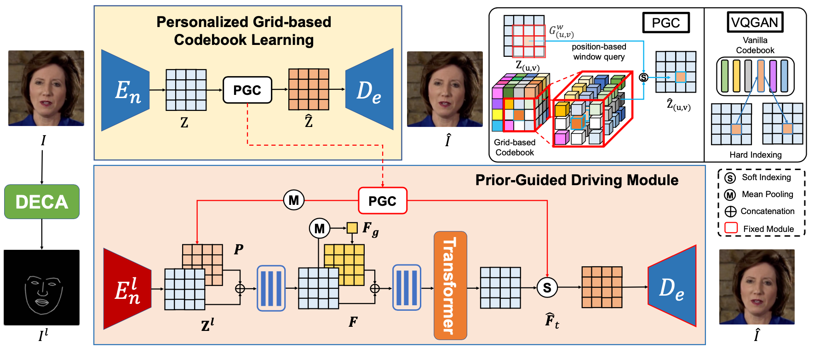

# Efficient Video Portrait Reenactment via Grid-based Codebook
by [Kaisiyuan Wang](https://unibruce.github.io/), [Hang Zhou](https://hangz-nju-cuhk.github.io/), [Qianyi Wu](https://wuqianyi.top/), [Jiaxiang Tang](https://me.kiui.moe/), Zhiliang Xu, Borong Liang, Tianshu Hu, Errui Ding, Jingtuo Liu, [Ziwei Liu](https://liuziwei7.github.io/), [Jingdong Wang](https://jingdongwang2017.github.io/).
## Introduction
This repository is a PyTorch implementation of our Siggraph 2023 paper [Efficient Video Portrait Reenactment via Grid-based Codebook](https://wywu.github.io/projects/VPGC_website).




## Installation 
This repository is based on Pytorch, so please follow the official instructions [here](https://pytorch.org/). The code is tested under pytorch1.7 and Python 3.6 on Ubuntu 16.04.
In addition, our pre-processing depends on a 3D reconstruction approach "DECA: Detailed Expression Capture and Animation" to produce 2D facial landmarks as driving signals. Please follow [here](https://github.com/yfeng95/DECA) to install it.

## Usage

### Inference
1. First, download the [pretrained models](https://unisyd-my.sharepoint.com/:f:/g/personal/kaisiyuan_wang_sydney_edu_au/Erym9uRQ_2ZMjxiIJu2Ru78BooBB5TMPxGVFVOKi-7AyhQ?e=Wferw2) and put them in the corresponding folder.
3. Run the following command to synthesize
```
cd Reenactment
sh demo.sh
```
3. The results are stored in outputs folder. 

### Training
#### Pre-processing
Given a portrait video (with a static background), we first extract the frames and crop the human face part out at the resolution of 512 x 512 by running
```
python pre_processing.py -i [video_path, xxx.mp4] -o [data_path, /%05d.jpg]
```
Sometimes the cropping will not be perfect, as some portraits have special facial structures. Please feel free to adjust the ratio value in this script, so that the entire human head part can be included.

You can either select videos from [HDTF](https://github.com/MRzzm/HDTF) or just record a video yourself, and the processed data should be stored in the "Dataset" Folder, which is structured as below:


                  

#### Stage 1: Efficient Portrait Modeling
```
cd Grid_Codebook_Modeling
python main.py --base configs/obama_sliding_4.yaml -t True --gpu [gpu_id]
```
The training data folder can be assigned at "Grid_Codebook_Modeling/config/lrw_train.yaml"
#### Stage 2: Landmark-to-Image Reenactment
```
cd Reenactment
python train_grid.py --data_root ['your dataset path'] -m ['Subject_name'] --load_path ['Pretrain Model path'] --gpu ["gpu_id"]
```
During training Stage 1, you will notice our VPGC has a much faster convergence process than VQGAN based on the vanilla codebook. A comparison of intermediate training results is shown below:

## Citation
If you find this code useful for your research, please cite our paper:
```
@inproceedings{10.1145/3588432.3591509,
    author = {Wang, Kaisiyuan and Zhou, Hang and Wu, Qianyi and Tang, Jiaxiang and Xu, Zhiliang and Liang, Borong and Hu, Tianshu and Ding, Errui and Liu, Jingtuo and Liu, Ziwei and Wang, Jingdong},
    title = {Efficient Video Portrait Reenactment via Grid-Based Codebook},
    year = {2023},
    isbn = {9798400701597},
    publisher = {Association for Computing Machinery},
    address = {New York, NY, USA},
    url = {https://doi.org/10.1145/3588432.3591509},
    doi = {10.1145/3588432.3591509},
    abstract = {While progress has been made in the field of portrait reenactment, the problem of how to efficiently produce high-fidelity and accurate videos remains. Recent studies build direct mappings between driving signals and their predictions, leading to failure cases when synthesizing background textures and detailed local motions. In this paper, we propose the Video Portrait via Grid-based Codebook (VPGC) framework, which achieves efficient and high-fidelity portrait modeling. Our key insight is to query driving signals in a position-aware textural codebook with an explicit grid structure. The grid-based codebook stores delicate textural information locally according to our observations on video portraits, which can be learned efficiently and precisely. We subsequently design a Prior-Guided Driving Module to predict reliable features from the driving signals, which can be later decoded back to high-quality video portraits by querying the codebook. Comprehensive experiments are conducted to validate the effectiveness of our approach.},
    booktitle = {ACM SIGGRAPH 2023 Conference Proceedings},
    articleno = {66},
    numpages = {9},
    keywords = {Facial Animation, Video Synthesis},
    location = {Los Angeles, CA, USA},
    series = {SIGGRAPH '23}
}
```
## Acknowledgement
This repo is built on [VQGAN](https://github.com/CompVis/taming-transformers) code, and we also borrow some architecture codes from [ViT](https://github.com/lucidrains/vit-pytorch) and [LSP](https://github.com/YuanxunLu/LiveSpeechPortraits).
